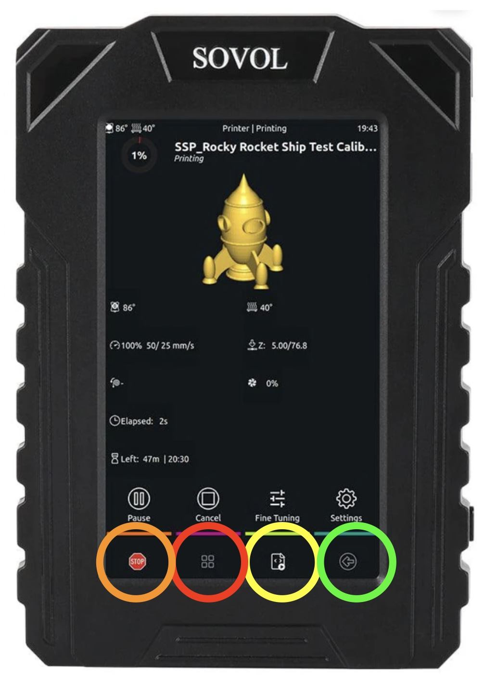
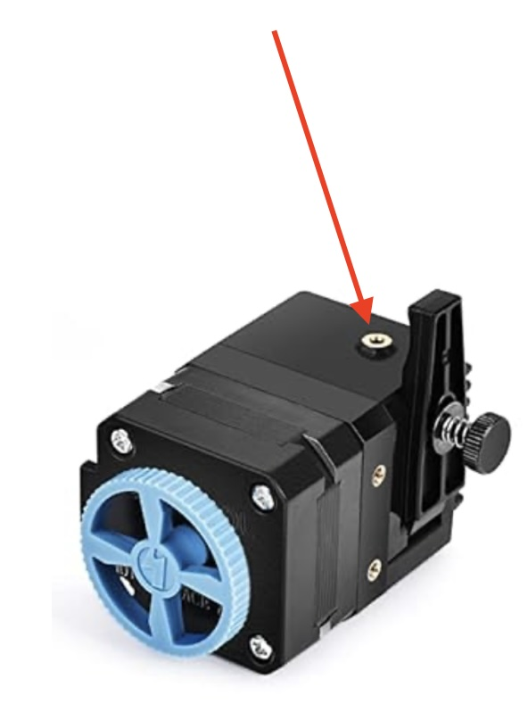

# Basics

These instructions outline use of the 3D Printing workstation in the Electronics Lab for printing on the Sovol 3D printers. Credentials for the workstation are available in the Electronics Lab.

This is a living document we intend to update as procedures are refined. If you encounter something incorrect or that you feel could be refined. You are welcome to open an issue or pull request on the [sparkmakerspace/3d-printing-guide](https://github.com/sparkmakerspace/3d-printing-guide)  repository on GitHub.

Please note that all units used in this document are metric (i.e. millimeters).

*Spark Members may direct questions on these processes and the equipment in the electronics lab to the spark electronics leads via either discord or email. See the "Additional Help" section at the end of this page for details.*

Happy printing!

This page is a living document automatically generated from a Git repository and will be updated over time. [Pull requests are welcome on the source repository on GitHub](https://github.com/sparkmakerspace/3d-printing-guide).

* Do not remove this line. It will not be displayed.
{:toc}

# Orientation

This is the basic file system viewer in Ubuntu and the folders on this
machine for printer use are marked.

* STL files (`\*.stl`) go in the models folder.

* Projects in OrcaSlicer can be saved in the projects folder.

* Anything downloaded in Firefox automagically ends up in the
    Downloads folder.

When you launch OrcaSlicer this is the basic screen you get.

From here you can open an existing project or start a new one (these
options are also in the dropdown menu in the upper left.)

# Putting objects in a project.

This is the basic layout you see when a new project is started.

Objects can be added by dragging and dropping from the file system
viewer. Once on the plate objects can be adjusted using the controls at
the top of the window.

The tools in the object controls from left to right are:

1. Translate: Move an object on the plate.

2. Rotate: Rotate an object.

3. Scale: Scale an object.

4. Place on face: This lets you pick a face on the object to align to
    the build plate.

5. Cut: Splits the object along a plane.

6. Mesh Boolean: This allows taking two meshes and doing a boolean
    operation on them (e.g. uninon.)

7. Support Painting: Allows you to force supports to or exclude
    supports from parts of the model.

8. Seam Painting: Allows you to tell the slicer where to put the seams
    in the outer perimeter.

9. Emboss: Allows you to imprint or extrude text on the object.

10. Measure: Slightly worse than a banana for scale.

The arrange tool is used to distribute multiple objects evenly around
the plate.

# Preparing for Slicing.

To setup for slicing we need to check the following things in the
control panel on the left side of the window. First we select the
printer we want to use. The printers have name tags on top of them.

Next we check that the correct type of filament is selected. This will
normally be PLA.

From there we go through the build settings to setup for the best
possible print results.

The first thing we look at is the quality tab. The main things we can
adjust here are:

1.  Layer Height: This defines the layer height for layers numbered 0.2**mm** is the default. Values as low as 0.15**mm** can be
    used for more detailed layer, and up to 0.3**mm** can be used for faster prints.

2.  First Layer Height: This defines the layer height for the first layer only. It should be set between 100% and 120% the other layers’
    height.

3.  Seam Position: This is used to decide how the seams will be arranged
    on the object:

    1.  Aligned: keeps all the seams together on the object making a distinct line.

    2.  Nearest: Puts the seam in a position to minimize head travel between layers. This will make the seam pattern semi random.

    3.  Back: Tries to hide view of the seams on the "back" of the object.

    4.  Random: Places the seams in a random position on each layer.

Next we pick the support options. If the object has overhanging or floating sections that need supports check the box for supports. From there select the type of supports to use. With "Normal" the supports will be a basic rectilinear pattern. With "Tree" supports the slicer will grow organic looking structures to support the object. With the "(auto)" option selected the slicer will automatically detect where supports are needed and add them in addition to any support painting that was done manually. With the "(manual)" option the slicer will only put supports where the user has forced them.

Finally we go to the tab for Other. The main option to adjust here is the brim. "Auto" will work for most meshes. If you want to force a brim select the appropriate kind for the mesh. And selecting "No-brim" will prevent a brim from being added.

# Slicing

Once we have all of our setttings checked hit the "Slice Plate" button in the upper right. The computer will think for a while then the view will look like below.

From here we want to check the estimation of filament, and the printer to make sure the print will complete. From there we hit the "Print" button and select "Upload & Print." **Do not leave the Electronics Lab until you have confirmed the first layer printed successfully.**

# And now we’re printing with filament.

We can now observe the state of the printer through the device tab in
OrcaSlicer.

# Using the Sovol Klipper Touchscreen

# Loading and Unloading Filament

## Loading and Unloading Filament. 

If an idle printer you wish to use is out of filament (or doesn't have enough remaining), the following sections outline the steps to unload and load filament.

Confirm that the filament you are loading is labeled (on the spool and/or box) as PLA or PLA+ (or PLA Pro). Speak with a lead before attempting to print any other material.
### Loading Filament

1.  Pick printer you would like to use.
1.  Home printer: (Wake screen by pressing the touchscreen, if necessary)  On home screen (Four squares-bottom left center), press "Homing" button, then press "Home All"
1.  Make sure the hot end is high enough above the print bed when you attempt to push through the filament so that it doesn’t clog up the nozzle, by raising the extruder in the Z-direction.
1. 	->To do this go to main menu, Press "Homing", to right of screen, press "Z+" button (top right) at least one time.
1.  Load spool on spool holder and prepare filament to load into extruder inlet by making sure there are no tangles of the filament winding.  
1.  Clip end of filament to have a clean end (if needed)
1.  Before you insert the filament into the extruder inlet, you must heat up the extruder.
	->To do this:
Press- Left arrow, at the bottom right of the screen
Press "Actions"
Press "Extrude"
*Press "Temperature", Select PLA (note: we do not print ABS at Spark)	
Allow extruder and build plate (print bed) to come up to temperature.  (wait approximately 2 mins), extruder temperature will rise to about 210C, bed temp will rise to 50C. (Wait- the actual temps are at the top of the screen)
Press- Left arrow (bottom right of the screen)
Press the "Extrude" button then "Load"
1.  Place filament into extruder inlet filament port
until you feel some resistance

1.  Press "Load" (If you get a warning: "extrude below minimum temp", go to *) until you see plastic extrude out of the hot end onto  the build plate.  Press load again until you see new color filament extruded onto build plate.
1.  Let go of the filament 
1.  Remove the extruded plastic from the build plate.
The filament is now loaded and ready to print.

### Unloading Filament (to change color or new spool)

2.  Home printer: On home Sovol screen, Press "Main Menu", press "Homing" button, then press "Home All" (wait for movement to stop)
2.  Press- Left arrow, at the bottom right of the screen (see green circle above)
Press "Temperature", Select "PLA"
	Allow extruder and build plate (print bed) to come up to temperature. (wait approximately 2 mins), extruder temperature will rise to about 210C, bed temp will rise to 50C.
Press left arrow (bottom right) to go to previous screen.
Press "Actions"
Press "Extrude"
Press "Unload", wheel on extruder will start to turn, at this point it is ok to pull on the filament as the filament is extracting. 
At this point the filament is unloaded.

# To print a previous print from the Klipper touchscreen

Press four squares
Press "Print" to reprint a previously uploaded print (Note: if you don’t have a print already loaded, please go to the section on "Putting Objects in a Project)
Look for your desired print file on the screen (you may need to scroll down the screen)
Hit the icon to the left of the file name
Select your print to reprint then press "Print"

Press "Print" to reprint a previously uploaded print (Note: if you don’t have a print already loaded, please go to the section on "Putting Objects in a Project)
Look for your prior print on the screen
Select your print to reprint then press "Print"

# Clearing the bed, what is ok to do and what not to put on the build plate.

It is ok to remove the bed and flex the metal plate to remove the plate.
It is OK to use your fingernail, plastic spatula or other non-metal tool to remove the residual filament on the print bed.
Please do not scrape or damage the print bed.

# Stopping a print:

Press the "stop" button (Orange circle)
Press Continue

# Troubleshooting / Additional Help

Should you run into questions not covered here, use one of the following options to get more help. Please provide as much detail as possible (*screenshots/images can  be a huge help in troubleshooting*).

* Email the [Electronics Leads](mailto:electronics@sparkmakerspace.org)
* Post a message in the Spark Discord (if you need an invite, ask!)
* Stop by [Electronics Night](https://electronicsnight.com)

## Common Printing Issues and Solutions

Some other helpful links:

* [Top 10 Common Printing Issues and Solutions](https://coprint3d.com/blogs/tips-tricks/top-10-common-printing-issues-and-solutions)

* [Common Problems in 3D Printing & How to Resolve Them](https://manufactur3dmag.com/common-problems-in-3d-printing-how-to-resolve-them-part-i/)

* [3D Printer Troubleshooting Guide to 19 Common 3D Printing Problems](https://www.geeetech.com/blog/3d-printing-trouble-shooting-guide/troubleshooting-guide-to-19-common-3d-printing-problemspart-one/)

* [3D Print Troubleshooting Guide](https://buildbee.com/blog/article/3d-print-troubleshooting-guide)
