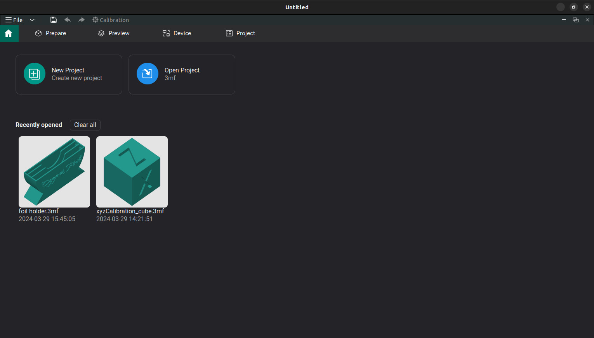
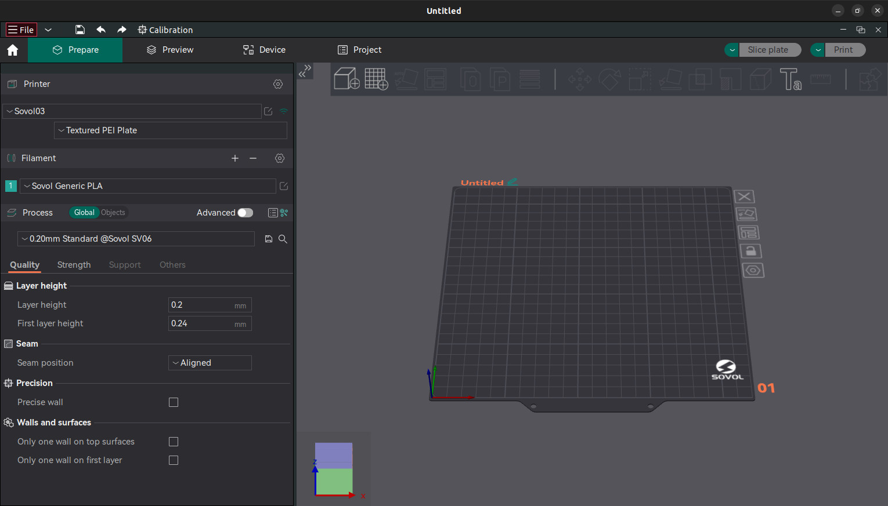
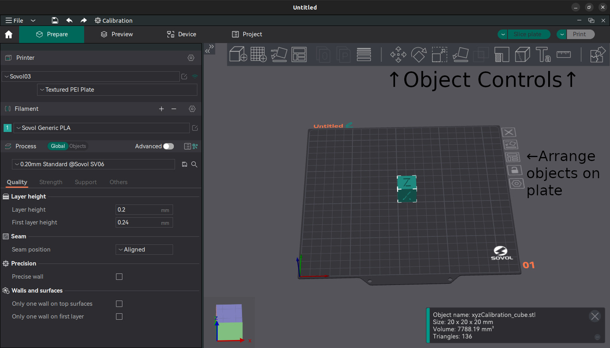
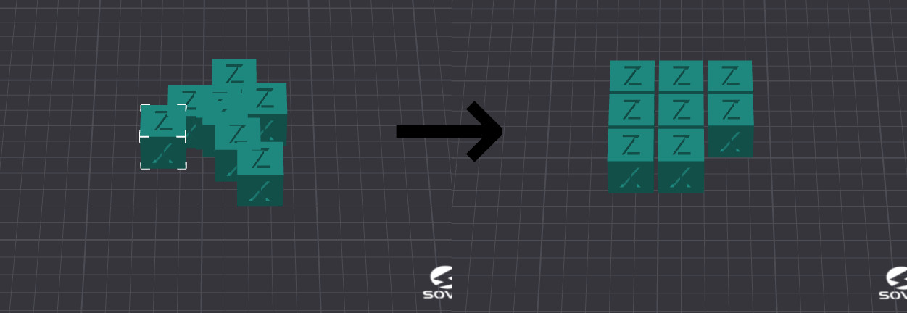
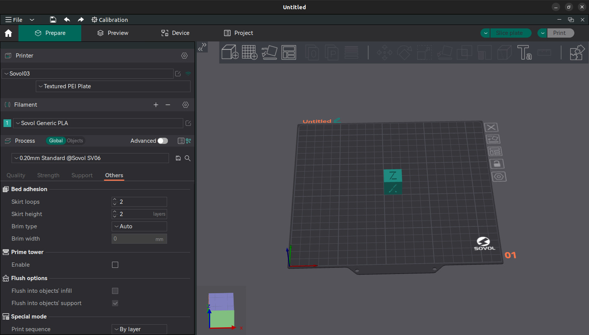
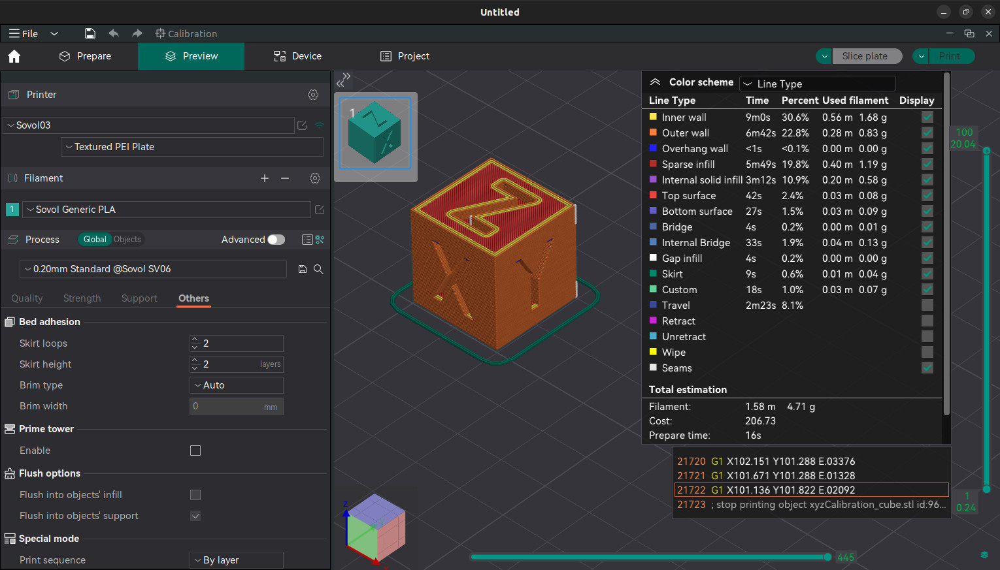

# Basics

This page is automatically generated from the [sparkmakerspace/3d-printing-guide](https://github.com/sparkmakerspace/3d-printing-guide) repository on GitHub.

# Orientation

This is the basic file system viewer in Ubuntu and the folders on this
machine for printer use are marked.

* STL files (\*.stl) go in the models folder.

* Projects in OrcaSlicer can be saved in the projects folder.

* Anything downloaded in Firefox automagically ends up in the
    Downloads folder.

When you launch OrcaSlicer this is the basic screen you get.

From here you can open an existing project or start a new one (these
options are also in the dropdown menu in the upper left.)

# Putting objects in a project.

This is the basic layout you see when a new project is started.

Objects can be added by dragging and dropping from the file system
viewer. Once on the plate objects can be adjusted using the controls at
the top of the window.

The tools in the object controls from left to right are:

1. Translate: Move an object on the plate.

2. Rotate: Rotate an object.

3. Scale: Scale an object.

4. Place on face: This lets you pick a face on the object to align to
    the build plate.

5. Cut: Splits the object along a plane.

6. Mesh Boolean: This allows taking two meshes and doing a boolean
    operation on them (e.g. uninon.)

7. Support Painting: Allows you to force supports to or exclude
    supports from parts of the model.

8. Seam Painting: Allows you to tell the slicer where to put the seams
    in the outer perimeter.

9. Emboss: Allows you to imprint or extrude text on the object.

10. Measure: Slightly worse than a banana for scale.

The arrange tool is used to distribute multiple objects evenly around
the plate.

# Preparing for Slicing.

To setup for slicing we need to check the following things in the
control panel on the left side of the window. First we select the
printer we want to use. The printers have name tags on top of them.

Next we check that the correct type of filament is selected. This will
normally be PLA.

From there we go through the build settings to setup for the best
possible print results.

The first thing we look at is the quality tab. The main things we can
adjust here are:

1.  Layer Height: This defines the layer height for layers numbered 0.2 **mm** is the default. Values as low as 1.5*m**m* can be
    used for more detailed layer, and up to 3.0*m**m* can be used for faster prints.

2.  First Layer Height: This defines the layer height for the first layer only. It should be set between 100% and 120% the other layers’
    height.

3.  Seam Position: This is used to decide how the seams will be arranged
    on the object:

    1.  Aligned: keeps all the seams together on the object making a distinct line.

    2.  Nearest: Puts the seam in a position to minimize head travel between layers. This will make the seam pattern semi random.

    3.  Back: Tries to hide view of the seams on the "back" of the object.

    4.  Random: Places the seams in a random position on each layer.

Next we pick the support options. If the object has overhanging or floating sections that need supports check the box for supports. From there select the type of supports to use. With "Normal" the supports will be a basic rectilinear pattern. With "Tree" supports the slicer will grow organic looking structures to support the object. With the "(auto)" option selected the slicer will automatically detect where supports are needed and add them in addition to any support painting that was done manually. With the "(manual)" option the slicer will only put supports where the user has forced them.

Finally we go to the tab for Other. The main option to adjust here is the brim. "Auto" will work for most meshes. If you want to force a brim select the appropriate kind for the mesh. And selecting "No-brim" will prevent a brim from being added.

# Now we slice.

Once we have all of our setttings checked hit the "Slice Plate" button in the upper right. The computer will think for a while then the view will look like below.

From here we want to check the estimation of filament, and the printer to make sure the print will complete. From there we hit the "Print" button and select "Upload & Print." **Once the print starts make sure to ensure the first layer completes successfully.**

# And now we’re printing with filament.

We can observe the state of the printer throught the device tab in
OrcaSlicer.

